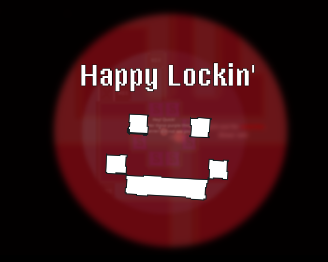

# Happy Lockin' - Ludum Dare 54

|             |                                                                                |
|-------------|--------------------------------------------------------------------------------|
| **Theme**   | _Limited Space_                                                                |
| **Date**    | _October 2023_                                                                 |
| **Type**    | _Compo_                                                                        |
| **Concept** | _Escape, if you can!_                                                          |

**:rocket: [Play it here!](https://srynetix.github.io/happy-lockin/)**

Welcome on my 8th **Ludum Dare** Compo entry!

Initially, I wanted to play with _Godot Engine 4.2_ (version _dev 5_), and it mostly worked for the first 24 hours.  
But during sunday morning, as I was playing with the _TileMap_, almost all of my tile colliders just disappeared / were buggy with no reason at all (_I think it has something to do with tile rotations, which does not exist in 4.1.1_).  
Well then, I migrated the project to version _4.1.1_, added more tiles to my tileset, redrew the buggy tiles, and everything was good!

So, the game! This time, I wanted to do something more... moody.

My personal take on the "limited space" theme : _you are limited in your movements, and at the same time, you are trapped_.

I imagined an **action/stealth game**, where you need to escape from where you are kept.
To do that, you will have to find all the keys, remove your enemies, and above all avoid the dreaded security scanner.
So be careful, be quick, and collect them all if you want to leave.

Watch out for the secrets. :wink:

**Software used**:
- _Game Engine_: [Godot Engine 4.1.1] with my [sxgd](https://github.com/Srynetix/sxgd) plugin collection,
- _"Art"_: [GIMP] then [Krita],
- _Sound effects and music track_: [FL Studio](https://www.image-line.com/fl-studio/), plus a few custom processed stock samples

_Good luck, and have fun!_

## Preview

[Godot Engine 4.1.1]: https://godotengine.org/
[GIMP]: https://www.gimp.org/
[Krita]: https://krita.org/fr/
